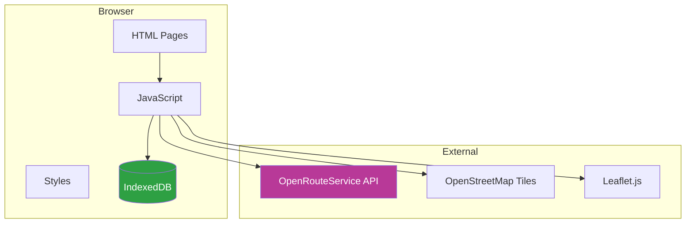
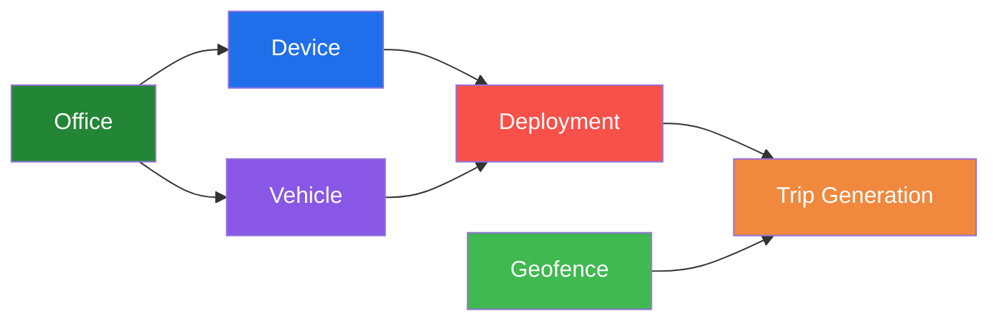
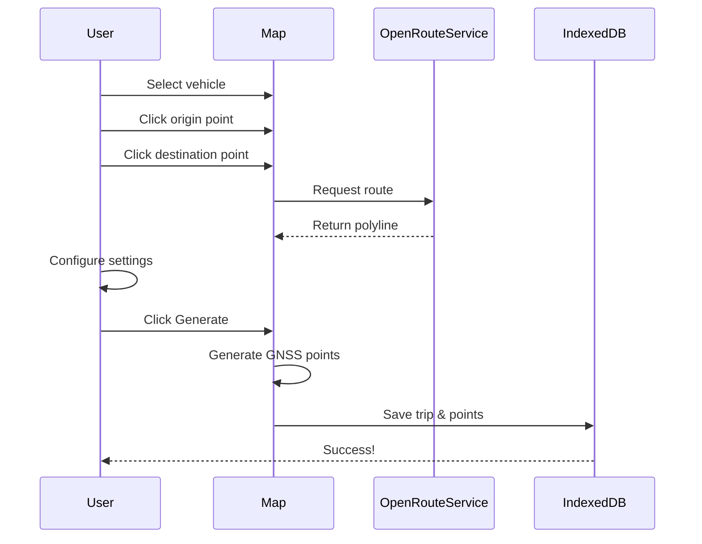
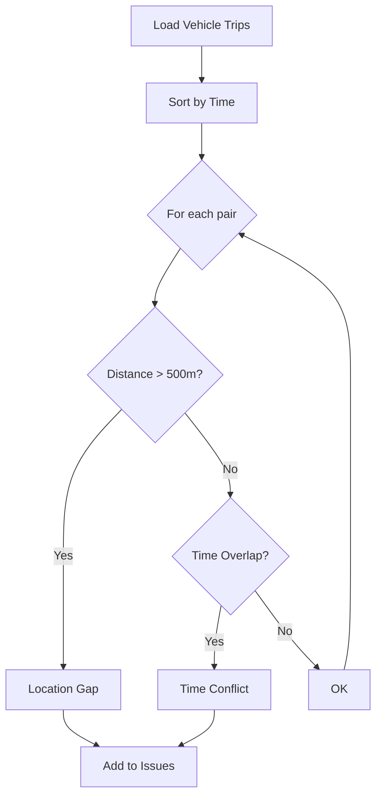
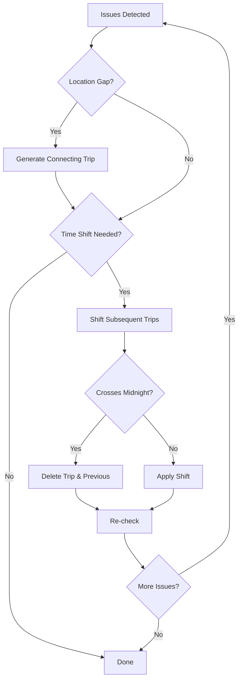

# GNSS Trajectory Generator

A browser-based application for generating simulated GNSS trajectory data for vehicle tracking systems. No backend required - runs entirely in the browser using IndexedDB for data persistence.

## 📋 Table of Contents

- [Features](#features)
- [Quick Start](#quick-start)
- [Architecture](#architecture)
- [Screen Guide](#screen-guide)
  - [Dashboard](#dashboard)
  - [Master Data Management](#master-data-management)
  - [Trajectory Generation](#trajectory-generation)
  - [Trip Viewer](#trip-viewer)
- [Data Flow](#data-flow)
- [Consistency Check](#consistency-check)
- [OpenRouteService API Setup](#openrouteservice-api-setup)
- [Data Schema](#data-schema)
- [Export & Import](#export--import)

---

## ✨ Features

- **Pure Client-Side**: No server or database required
- **Master Data Management**: Offices, Devices, Vehicles, Deployments, Geofences
- **Individual Trip Generation**: Manual origin/destination selection with customizable parameters
- **Batch Trip Generation**: Automatic multi-day trip generation with random parameters
- **Trip Viewer**: Visualize generated trajectories on maps
- **Consistency Check**: Detect and fix gaps in vehicle trajectories
- **CSV Import/Export**: Full data portability
- **Dark Mode UI**: GitHub-inspired dark theme
- **OpenRouteService Routing**: Free, open-source routing with no data storage restrictions

---

## 🚀 Quick Start

1. Open `index.html` in a modern browser (Chrome recommended)
2. Get a free **OpenRouteService API key** at [openrouteservice.org](https://openrouteservice.org/dev/#/signup)
3. Enter your API key in **Settings**
4. Create master data (Offices → Devices → Vehicles → Deployments → Geofences)
5. Generate trajectories using Individual or Batch generation
6. View and export your data

---

## 🏗️ Architecture



### File Structure

```
trajectory_gen_app/
├── index.html              # Dashboard & Navigation
├── offices.html            # Office management
├── devices.html            # Device management
├── vehicles.html           # Vehicle management
├── deployments.html        # Vehicle-Device mapping
├── geofences.html          # Geofence management (with map)
├── settings.html           # OpenRouteService API configuration
├── trajectory.html         # Individual trip generation
├── trajectory_batch.html   # Batch trip generation
├── trips.html              # Trip viewer & consistency check
├── css/
│   └── style.css           # GitHub dark theme styles
├── js/
│   ├── common.js           # Shared utilities (IndexedDB, CSV, etc.)
│   ├── offices.js
│   ├── devices.js
│   ├── vehicles.js
│   ├── deployments.js
│   ├── geofences.js
│   ├── settings.js
│   ├── trajectory.js
│   ├── trajectory_batch.js
│   └── trips.js
└── data/
    └── sample_geofences.csv  # Sample data for Tokyo/Nagoya/Osaka ward offices
```

---

## 📱 Screen Guide

### Dashboard

The main navigation hub displaying data counts and quick access to all features.

### Master Data Management

#### Data Creation Flow



| Screen          | Purpose                  | Key Fields                        |
| --------------- | ------------------------ | --------------------------------- |
| **Offices**     | Business locations       | name, address, phone, email       |
| **Devices**     | Tracking devices         | serial_no, IMEI, model, status    |
| **Vehicles**    | Company vehicles         | name, plate_no, type, capacity    |
| **Deployments** | Device ↔ Vehicle mapping | device, vehicle, install date     |
| **Geofences**   | Location boundaries      | name, type, polygon (draw on map) |

---

### Trajectory Generation

#### Individual Generation (`trajectory.html`)

Generate a single trip with full control over parameters.



**Settings:**

| Parameter      | Range       | Description              |
| -------------- | ----------- | ------------------------ |
| Start DateTime | Any         | Trip start time          |
| Interval       | 1-60 sec    | Position sampling rate   |
| Average Speed  | 10-120 km/h | Vehicle speed            |
| Break Time     | 0-60 min    | Rest stop duration       |
| Min Accuracy   | 1-50 m      | Best GPS accuracy        |
| Max Accuracy   | 1-100 m     | Worst GPS accuracy       |
| Outlier Rate   | 0-100%      | Bad position probability |

**Generated Data Includes:**
- Travel points along the route with random offset
- Break points (clustered within 30m radius)
- Arrival stay points (15-60 min at destination)
- Outlier points (100-2000m offset based on rate)

#### Batch Generation (`trajectory_batch.html`)

Automatically generate multiple trips over a date range.

**Fixed Settings:**
- Interval: 10 seconds
- Accuracy: 3-20 meters
- Break: Random (0, 10, 20, or 30 min)
- Speed: Random 30-60 km/h
- Outlier Rate: 0%

**Time Management:**
- First trip: 6:00-9:00 AM (random)
- Subsequent trips: Previous trip end + 30-120 min gap
- Trips after 8:00 PM are skipped

---

### Trip Viewer

View generated trips and their GNSS points on a full-screen map.

---

## 🔧 Consistency Check

Ensures vehicle trajectories are continuous (no "teleportation" between trips).

### Detection



### Fix Process



### Example Fix

**Before:**
```
Trip A: Tokyo → Osaka    (9:00 - 12:00)
Trip B: Nagoya → Kyoto   (11:00 - 13:00)  ← Time overlap + Location gap!
```

**After:**
```
Trip A: Tokyo → Osaka          (9:00 - 12:00)
NEW:    Osaka → Nagoya         (12:00 - 13:30)  ← Connecting trip
Trip B: Nagoya → Kyoto         (14:00 - 16:00)  ← Time shifted
```

---

## 🔑 OpenRouteService API Setup

### Why OpenRouteService?

- **No credit card required** - Free tier with email signup only
- **No data storage restrictions** - Generated GNSS data can be freely stored and used
- **Based on OpenStreetMap** - Open data, no licensing concerns
- **Generous free tier** - 2,000 requests/day (~60,000/month)

### Setup Steps

1. Go to [openrouteservice.org](https://openrouteservice.org/dev/#/signup)
2. Sign up with email (free)
3. Verify email
4. Go to Dashboard → Tokens
5. Create a new token
6. Enter the token in Settings page

### Pricing Notes

| Service             | Free Tier     | Notes             |
| ------------------- | ------------- | ----------------- |
| OpenRouteService    | 2,000 req/day | No credit card    |
| Leaflet + OSM Tiles | Unlimited     | Free, open source |

**Map Display:**
- Uses Leaflet.js with CartoDB Dark tiles (based on OpenStreetMap)
- No API key required for map display
- Dark theme matching the app design

---

## 📊 Data Schema

### GNSS Point (t_gnss_tracking_log compatible)

| Field                 | Type       | Description           |
| --------------------- | ---------- | --------------------- |
| id                    | Integer    | Auto-generated        |
| trip_id               | Integer    | Parent trip reference |
| device_timestamp      | ISO String | Device time           |
| positioning_timestamp | ISO String | GPS fix time          |
| imei                  | String     | Device IMEI           |
| gps_status            | String     | "VALID"               |
| latitude              | Float      | -90 to 90             |
| longitude             | Float      | -180 to 180           |
| altitude              | Float      | Meters                |
| speed                 | Float      | km/h                  |
| direction             | Float      | 0-360 degrees         |
| hdop                  | Float      | Horizontal dilution   |
| delete_flag           | Boolean    | Soft delete           |

### Trip Metadata

| Field               | Type       | Description           |
| ------------------- | ---------- | --------------------- |
| id                  | Integer    | Auto-generated        |
| vehicle_id          | Integer    | Vehicle reference     |
| imei                | String     | Device IMEI           |
| origin_lat/lng      | Float      | Start coordinates     |
| origin_name         | String     | Start location name   |
| destination_lat/lng | Float      | End coordinates       |
| destination_name    | String     | End location name     |
| distance_meters     | Integer    | Route distance        |
| start_time          | ISO String | Trip start            |
| end_time            | ISO String | Trip end              |
| point_count         | Integer    | GNSS point count      |
| settings            | Object     | Generation parameters |
| is_connecting_trip  | Boolean    | Auto-generated flag   |

---

## 📤 Export & Import

### Export Formats

All data exports to CSV format compatible with database import.

**Export Options:**
- **Dashboard**: Export all data (all tables)
- **Individual Screens**: Export specific entity data
- **Trip Viewer**: Export trips + GNSS points

### Import

- **Master Data**: CSV import on each management screen
- **Geofences**: Bulk import with GeoJSON polygon data

### Sample Files

`data/sample_geofences.csv` includes 63 pre-defined geofences:
- Tokyo 23 ward offices
- Nagoya 16 ward offices  
- Osaka 24 ward offices

---

## 🛠️ Technical Notes

### Browser Support

- **Recommended**: Chrome (latest)
- **Supported**: Edge, Firefox, Safari
- **Required**: IndexedDB support

### Data Persistence

- All data stored in browser's IndexedDB
- Data persists across sessions
- Clear browser data will delete all app data
- Use Export function for backup


### Attribution

This application uses:
- [OpenRouteService](https://openrouteservice.org/) - Routing API
- [OpenStreetMap](https://www.openstreetmap.org/) - Map data
- [CARTO](https://carto.com/) - Map tiles (CartoDB Dark Matter)
- [Leaflet](https://leafletjs.com/) - Map library

