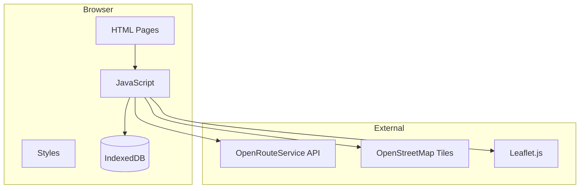
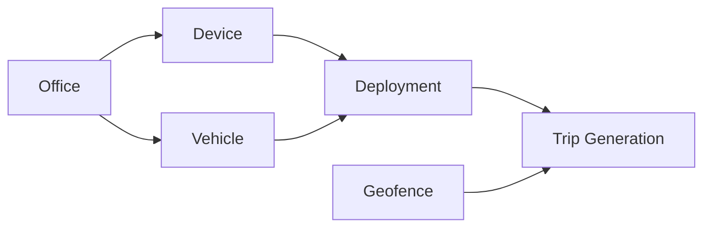

# GNSS Trajectory Generator

A browser-based application for generating simulated GNSS trajectory data for vehicle tracking systems. No backend required - runs entirely in the browser using IndexedDB for data persistence.

## 📋 Table of Contents

- [Features](#features)
- [Quick Start](#quick-start)
- [Step-by-Step Guide](#step-by-step-guide)
- [Architecture](#architecture)
- [Screen Guide](#screen-guide)
- [OpenRouteService API Setup](#openrouteservice-api-setup)
- [Data Schema](#data-schema)
- [Export & Import](#export--import)
- [Technical Notes](#technical-notes)

---

## ✨ Features

- **Pure Client-Side**: No server or database required
- **Master Data Management**: Offices, Devices, Vehicles, Deployments, Geofences
- **Individual Trip Generation**: Manual origin/destination selection with customizable parameters
- **Batch Trip Generation**: Automatic multi-day trip generation with random parameters
- **Trip Viewer**: Visualize generated trajectories on maps
- **CSV Import/Export**: Full data portability
- **Dark Mode UI**: GitHub-inspired dark theme
- **OpenRouteService Routing**: Free, open-source routing with no data storage restrictions

---

## 🚀 Quick Start

1. Open `index.html` in a modern browser (Chrome recommended)
2. Get a free **OpenRouteService API key** at [openrouteservice.org](https://openrouteservice.org/dev/#/signup)
3. Enter your API key in **Settings**
4. Create master data (Offices → Devices → Vehicles → Deployments → Geofences)
5. Generate trajectories using Individual or Batch generation
6. View and export your data

---

## 📝 Step-by-Step Guide

マスターデータを作成してから軌跡データを生成するまでの詳細な手順を説明します。

### Step 1: OpenRouteService API Keyの設定

1. [openrouteservice.org](https://openrouteservice.org/dev/#/signup) でアカウントを作成
2. メール認証を完了
3. Dashboard → Tokens でAPIトークンを作成
4. アプリの **Settings** 画面でAPIキーを入力して保存

### Step 2: 事業所マスタ (Offices) の登録

1. **Offices** 画面を開く
2. 「Add Office」ボタンをクリック
3. 以下の必須項目を入力：
   - Company ID（会社識別子）
   - Office Name（事業所名）
   - Prefecture ID（都道府県コード 1-47）
   - Office Type（事業所タイプ）
4. 緯度・経度を入力（ジオフェンスと関連付ける場合に必要）
5. 「Save」で保存

### Step 3: デバイスマスタ (Devices) の登録

1. **Devices** 画面を開く
2. 「Add Device」ボタンをクリック
3. 以下の必須項目を入力：
   - Serial No（デバイスシリアル番号）
   - IMEI（15桁の国際モバイル機器識別番号）
   - IMSI（最大15桁のSIM識別番号）
4. 必要に応じてFirmware ID、バージョンを入力
5. 「Save」で保存

### Step 4: 車両マスタ (Vehicles) の登録

1. **Vehicles** 画面を開く
2. 「Add Vehicle」ボタンをクリック
3. 以下の必須項目を入力：
   - Vehicle Number（車番）
   - Model（型式）
   - Fuel Type（燃料タイプ）
4. 必要に応じてOffice（事業所）を関連付け
5. 「Save」で保存

### Step 5: デバイス配備 (Deployments) の登録

1. **Deployments** 画面を開く
2. 「Add Deployment」ボタンをクリック
3. 以下を選択・入力：
   - Device（Step 3で登録したデバイス）
   - Vehicle（Step 4で登録した車両）
   - Deploy Start（配備開始日時）
4. 「Save」で保存

> **重要**: 軌跡データを生成するには、車両にデバイスが配備されている必要があります。

### Step 6: ジオフェンスマスタ (Geofences) の登録

ジオフェンスは軌跡の出発地・目的地として使用されます。

#### 方法1: サンプルデータをインポート

`data/sample/` ディレクトリにサンプルデータが用意されています：

| ファイル | 内容 |
|---------|------|
| `sample_geofences.csv` | 東京23区・名古屋16区・大阪24区の区役所（計63件） |

1. **Geofences** 画面を開く
2. 「Import CSV」ボタンをクリック
3. `data/sample/sample_geofences.csv` を選択
4. インポート完了後、地図上にジオフェンスが表示されます

#### 方法2: 手動で作成

1. **Geofences** 画面を開く
2. 地図上でポリゴンツール（左上のアイコン）を使用して領域を描画
3. フォームに以下を入力：
   - Geofence Name（名称）
   - Place ID（場所ID）
   - Geofence Number（ジオフェンス番号）
4. 「Save」で保存

### Step 7: 軌跡データの生成

マスターデータの準備が完了したら、軌跡データを生成できます。

#### Individual Generation（個別生成）

1. **Individual Gen** 画面を開く
2. Vehicle（車両）を選択
3. 地図上で出発地と目的地のジオフェンスをクリック（またはドロップダウンで選択）
4. 生成パラメータを設定：
   - Start DateTime（開始日時）
   - Interval（測位間隔）
   - Average Speed（平均速度）
   - Break Time（休憩時間）
   - Accuracy（測位精度）
5. 「Generate」ボタンで生成
6. 「Save」ボタンでデータを保存（CSVも自動ダウンロード）

#### Batch Generation（一括生成）

1. **Batch Gen** 画面を開く
2. Vehicle（車両）を選択
3. 日付範囲とTrips per Day（1日あたりのトリップ数）を設定
4. 「Start Batch Generation」で生成開始
5. 処理完了後、Tripsページで確認

### Step 8: 生成データの確認・エクスポート

1. **Trips** 画面で生成されたトリップを確認
2. 地図上でルートとGNSSポイントを表示
3. 「Export」ボタンでCSVファイルをダウンロード

---

## 🏗️ Architecture



### File Structure

```
trajectory_gen_app/
├── index.html              # Dashboard & Navigation
├── README.md               # This file
├── html/
│   ├── offices.html        # Office management
│   ├── devices.html        # Device management
│   ├── vehicles.html       # Vehicle management
│   ├── deployments.html    # Vehicle-Device mapping
│   ├── geofences.html      # Geofence management (with map)
│   ├── settings.html       # OpenRouteService API configuration
│   ├── trajectory.html     # Individual trip generation
│   ├── trajectory_batch.html # Batch trip generation
│   └── trips.html          # Trip viewer
├── css/
│   └── style.css           # GitHub dark theme styles
├── js/
│   ├── common.js           # Shared utilities (IndexedDB, CSV, etc.)
│   ├── offices.js
│   ├── devices.js
│   ├── vehicles.js
│   ├── deployments.js
│   ├── geofences.js
│   ├── settings.js
│   ├── trajectory.js
│   ├── trajectory_batch.js
│   └── trips.js
└── data/
    └── sample/
        └── sample_geofences.csv  # Sample geofences (Tokyo/Nagoya/Osaka)
```

---

## 📱 Screen Guide

### Dashboard

The main navigation hub displaying data counts and quick access to all features.

### Master Data Management

#### Data Creation Flow



| Screen          | Purpose                  | Key Fields                                    |
| --------------- | ------------------------ | --------------------------------------------- |
| **Offices**     | Business locations       | company_id, office_name, prefecture_id, type  |
| **Devices**     | Tracking devices         | serial_no, IMEI, IMSI, fw_version             |
| **Vehicles**    | Company vehicles         | vehicle_number, model, model_description      |
| **Deployments** | Device ↔ Vehicle mapping | device, vehicle, deploy_start, device_status  |
| **Geofences**   | Location boundaries      | place_id, geofence_number, polygon            |

---

### Trajectory Generation

#### Individual Generation (`html/trajectory.html`)

Generate a single trip with full control over parameters.

**Settings:**

| Parameter      | Range       | Description              |
| -------------- | ----------- | ------------------------ |
| Start DateTime | Any         | Trip start time          |
| Interval       | 1-60 sec    | Position sampling rate   |
| Average Speed  | 10-120 km/h | Vehicle speed            |
| Break Time     | 0-60 min    | Rest stop duration       |
| Min Accuracy   | 1-50 m      | Best GPS accuracy        |
| Max Accuracy   | 1-100 m     | Worst GPS accuracy       |
| Outlier Rate   | 0-100%      | Bad position probability |

**Generated Data Includes:**
- Travel points along the route with random offset
- Break points (within 10m radius, 1-minute interval)
- Arrival stay points (15-60 min at destination, within 10m radius, 1-minute interval)
- Outlier points (100-2000m offset based on rate)

#### Batch Generation (`html/trajectory_batch.html`)

Automatically generate multiple trips over a date range.

**Fixed Settings:**
- Interval: 10 seconds (travel), 60 seconds (break/stay)
- Accuracy: 3-20 meters
- Break: Random (0, 10, 20, or 30 min)
- Speed: Random 30-60 km/h
- Outlier Rate: 0%

**Time Management:**
- First trip: 6:00-9:00 AM (random)
- Subsequent trips: Previous trip end + 30-120 min gap
- Trips after 8:00 PM are skipped

---

### Trip Viewer

View generated trips and their GNSS points on a full-screen map.

---

## 🔑 OpenRouteService API Setup

### Why OpenRouteService?

- **No credit card required** - Free tier with email signup only
- **No data storage restrictions** - Generated GNSS data can be freely stored and used
- **Based on OpenStreetMap** - Open data, no licensing concerns
- **Generous free tier** - 2,000 requests/day (~60,000/month)

### Setup Steps

1. Go to [openrouteservice.org](https://openrouteservice.org/dev/#/signup)
2. Sign up with email (free)
3. Verify email
4. Go to Dashboard → Tokens
5. Create a new token
6. Enter the token in Settings page

### Pricing Notes

| Service             | Free Tier     | Notes             |
| ------------------- | ------------- | ----------------- |
| OpenRouteService    | 2,000 req/day | No credit card    |
| Leaflet + OSM Tiles | Unlimited     | Free, open source |

**Map Display:**
- Uses Leaflet.js with CartoDB Dark tiles (based on OpenStreetMap)
- No API key required for map display
- Dark theme matching the app design

---

## 📊 Data Schema

### GNSS Point (t_gnss_tracking_log compatible)

| Field                    | Type       | Description                |
| ------------------------ | ---------- | -------------------------- |
| id                       | bigint     | Auto-generated             |
| device_timestamp         | timestamp  | Device time                |
| positioning_timestamp    | timestamp  | GPS fix time               |
| imei                     | bigint     | Device IMEI                |
| gps_status               | varchar    | "VALID" or "LOW_ACCURACY"  |
| latitude                 | double     | -90 to 90                  |
| longitude                | double     | -180 to 180                |
| altitude                 | double     | Meters                     |
| speed                    | double     | km/h                       |
| direction                | double     | 0-360 degrees              |
| authentication_status    | integer    | Authentication status      |
| base_info                | varchar    | Base info                  |
| hdop                     | double     | Horizontal dilution        |
| lte_rssi                 | integer    | LTE signal strength        |
| mmri_*                   | double     | MMRI related fields        |
| cellular_*               | various    | Cellular positioning data  |
| ekf_*                    | double     | EKF positioning data       |
| fw_version               | varchar    | Firmware version           |
| delete_flag              | boolean    | Soft delete                |

### Trip Metadata

| Field               | Type       | Description           |
| ------------------- | ---------- | --------------------- |
| id                  | Integer    | Auto-generated        |
| vehicle_id          | bigint     | Vehicle reference     |
| imei                | bigint     | Device IMEI           |
| origin_lat/lng      | Float      | Start coordinates     |
| origin_name         | String     | Start location name   |
| destination_lat/lng | Float      | End coordinates       |
| destination_name    | String     | End location name     |
| distance_meters     | Integer    | Route distance        |
| start_time          | ISO String | Trip start            |
| end_time            | ISO String | Trip end              |
| point_count         | Integer    | GNSS point count      |
| settings            | Object     | Generation parameters |

---

## 📤 Export & Import

### Export Formats

All data exports to CSV format compatible with database import.

**Export Options:**
- **Dashboard**: Export all data (all tables)
- **Individual Screens**: Export specific entity data
- **Trip Viewer**: Export trips + GNSS points

### Import

- **Master Data**: CSV import on each management screen
- **Geofences**: Bulk import with GeoJSON polygon data

### Sample Files

`data/sample/sample_geofences.csv` includes 63 pre-defined geofences:
- Tokyo 23 ward offices（東京23区の区役所）
- Nagoya 16 ward offices（名古屋16区の区役所）
- Osaka 24 ward offices（大阪24区の区役所）

---

## 🛠️ Technical Notes

### Browser Support

- **Recommended**: Chrome (latest)
- **Supported**: Edge, Firefox, Safari
- **Required**: IndexedDB support

### Data Persistence

- All data stored in browser's IndexedDB
- Data persists across sessions
- Clear browser data will delete all app data
- Use Export function for backup

### Attribution

This application uses:
- [OpenRouteService](https://openrouteservice.org/) - Routing API
- [OpenStreetMap](https://www.openstreetmap.org/) - Map data
- [CARTO](https://carto.com/) - Map tiles (CartoDB Dark Matter)
- [Leaflet](https://leafletjs.com/) - Map library
