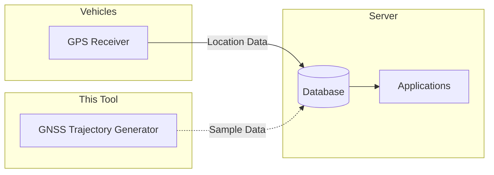
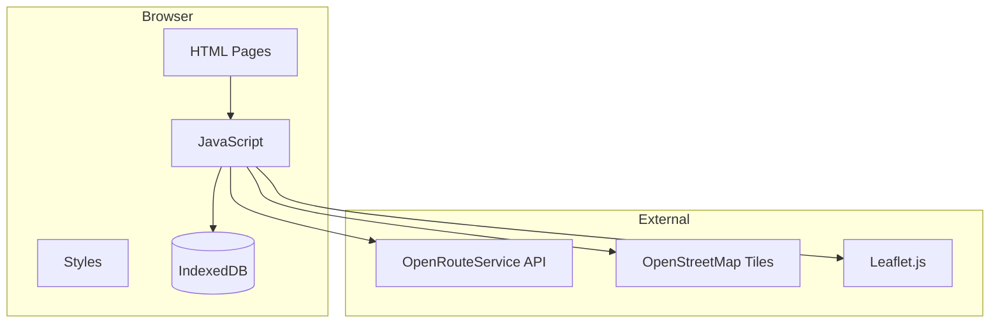
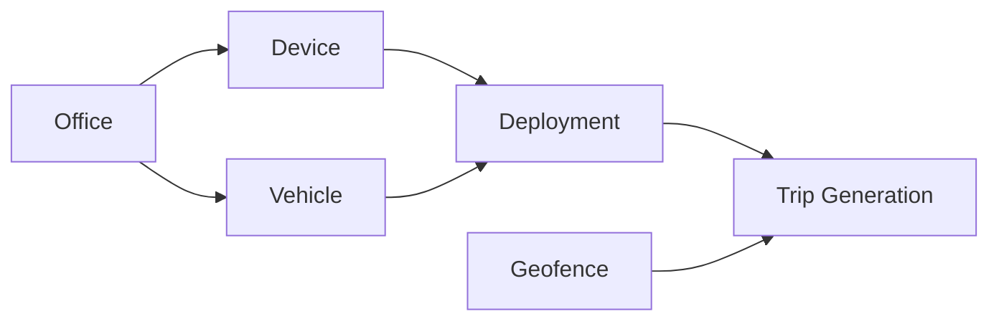

# GNSS Trajectory Generator

A browser-based application for generating simulated GNSS trajectory data for vehicle tracking systems. No backend required - runs entirely in the browser using IndexedDB for data persistence.

## Objectives

### System Overview

This tool generates sample GNSS trajectory data for vehicle tracking systems.



### Background

In vehicle tracking systems where servers collect trajectory location data from devices, there are two common challenges:

1. **Need for realistic trajectory data** - Testing and demo screens require more realistic trajectory data rather than simplistic dummy data
2. **Easy-to-use sample data for local development** - Developers need readily available sample data that can be used without complex setup

This tool was created to solve these problems by providing a browser-based GNSS trajectory data generator that produces realistic sample data for development, testing, and demonstrations.

---

## Table of Contents

- [Objectives](#objectives)
- [Features](#features)
- [Quick Start](#quick-start)
- [Step-by-Step Guide](#step-by-step-guide)
- [Architecture](#architecture)
- [Screen Guide](#screen-guide)
- [OpenRouteService API Setup](#openrouteservice-api-setup)
- [Data Schema](#data-schema)
- [Export & Import](#export--import)
- [Technical Notes](#technical-notes)

---

## Features

- **Pure Client-Side**: No server or database required
- **Master Data Management**: Offices, Devices, Vehicles, Deployments, Geofences
- **Individual Trip Generation**: Manual origin/destination selection with customizable parameters
- **Batch Trip Generation**: Automatic multi-day trip generation with random parameters
- **Trip Viewer**: Visualize generated trajectories on maps
- **CSV Import/Export**: Full data portability
- **Dark Mode UI**: GitHub-inspired dark theme
- **OpenRouteService Routing**: Free, open-source routing with no data storage restrictions

---

## Quick Start

1. Open `index.html` in a modern browser (Chrome recommended)
2. Get a free **OpenRouteService API key** at [openrouteservice.org](https://openrouteservice.org/dev/#/signup)
3. Enter your API key in **Settings**
4. Import sample CSV files from `data/sample/` (Offices → Devices → Vehicles → Deployments → Geofences)
5. Generate trajectories using Individual or Batch generation
6. View and export your data

---

## Step-by-Step Guide

This section provides detailed instructions from importing master data to generating trajectory data.

### Step 1: Configure OpenRouteService API Key

1. Create an account at [openrouteservice.org](https://openrouteservice.org/dev/#/signup)
2. Complete email verification
3. Go to Dashboard → Tokens and create an API token
4. Enter the API key in the app's **Settings** page and save

### Step 2: Import Master Data from Sample CSV Files

Sample CSV files are provided in the `data/sample/` directory. Import them in the following order:

| Order | File                     | Page        | Contents                                       |
| ----- | ------------------------ | ----------- | ---------------------------------------------- |
| 1     | `sample_offices.csv`     | Offices     | 6 offices (Tokyo, Nagoya, Osaka)               |
| 2     | `sample_devices.csv`     | Devices     | 10 tracking devices                            |
| 3     | `sample_vehicles.csv`    | Vehicles    | 10 vehicles (trucks, EV, hybrid, LPG)          |
| 4     | `sample_deployments.csv` | Deployments | 7 device-vehicle mappings                      |
| 5     | `sample_geofences.csv`   | Geofences   | 63 geofences (Tokyo/Nagoya/Osaka ward offices) |

**Import Steps (repeat for each file):**

1. Open the corresponding page (e.g., **Offices**)
2. Click the **"Import CSV"** button
3. Select the sample CSV file
4. Verify the imported data in the table

> **Important**: Import in order (1→5) because Vehicles reference Offices, and Deployments reference both Devices and Vehicles.

### Step 3: Verify Imported Data

After importing all sample files, you should have:
- **6 Offices**: Tokyo HQ, Tokyo Warehouse, Nagoya Branch, Nagoya DC, Osaka Branch, Osaka Warehouse
- **10 Devices**: DEV-001 to DEV-010
- **10 Vehicles**: Various trucks and special vehicles (EV, Hybrid, LPG)
- **7 Deployments**: 7 devices deployed to 7 vehicles
- **63 Geofences**: Ward offices in Tokyo (23), Nagoya (16), and Osaka (24)

### Step 4: Generate Trajectory Data

Once master data is imported, you can generate trajectory data.

#### Individual Generation

1. Open the **Individual Gen** page
2. Select a Vehicle (e.g., "Tokyo Truck 1")
3. Click on origin and destination geofences on the map (or select from dropdowns)
4. Configure generation parameters:
   - Start DateTime
   - Interval (positioning interval)
   - Average Speed
   - Break Time
   - Accuracy
5. Click "Generate"
6. Click "Save" to save data (CSV files are also downloaded automatically)

#### Batch Generation

1. Open the **Batch Gen** page
2. Select a Vehicle
3. Set the date range and Trips per Day
4. Click "Start Batch Generation"
5. After completion, verify on the Trips page

### Step 5: Verify and Export Generated Data

1. View generated trips on the **Trips** page
2. Display routes and GNSS points on the map
3. Click "Export" to download CSV files

### Creating Your Own Master Data (Optional)

If you prefer to create master data manually instead of importing CSV files:

1. **Offices**: Click "Add Office" and fill in company_id, office_name, prefecture_id, office_type
2. **Devices**: Click "Add Device" and fill in serial_no, IMEI (15 digits), IMSI
3. **Vehicles**: Click "Add Vehicle" and fill in vehicle_number, model, fuel_code
4. **Deployments**: Click "Add Deployment" to link a device to a vehicle
5. **Geofences**: Draw polygons on the map or enter GeoJSON geometry manually

---

## Architecture



### File Structure

```
trajectory_gen_app/
├── index.html              # Dashboard & Navigation
├── README.md               # This file
├── html/
│   ├── offices.html        # Office management
│   ├── devices.html        # Device management
│   ├── vehicles.html       # Vehicle management
│   ├── deployments.html    # Vehicle-Device mapping
│   ├── geofences.html      # Geofence management (with map)
│   ├── settings.html       # OpenRouteService API configuration
│   ├── trajectory.html     # Individual trip generation
│   ├── trajectory_batch.html # Batch trip generation
│   └── trips.html          # Trip viewer
├── css/
│   └── style.css           # GitHub dark theme styles
├── js/
│   ├── common.js           # Shared utilities (IndexedDB, CSV, etc.)
│   ├── offices.js
│   ├── devices.js
│   ├── vehicles.js
│   ├── deployments.js
│   ├── geofences.js
│   ├── settings.js
│   ├── trajectory.js
│   ├── trajectory_batch.js
│   └── trips.js
└── data/
    └── sample/
        ├── sample_offices.csv      # 6 sample offices
        ├── sample_devices.csv      # 10 sample devices
        ├── sample_vehicles.csv     # 10 sample vehicles
        ├── sample_deployments.csv  # 7 device-vehicle mappings
        └── sample_geofences.csv    # 63 geofences (Tokyo/Nagoya/Osaka)
```

---

## Screen Guide

### Dashboard

The main navigation hub displaying data counts and quick access to all features.

### Master Data Management

#### Data Creation Flow



| Screen          | Purpose                | Key Fields                                   |
| --------------- | ---------------------- | -------------------------------------------- |
| **Offices**     | Business locations     | company_id, office_name, prefecture_id, type |
| **Devices**     | Tracking devices       | serial_no, IMEI, IMSI, fw_version            |
| **Vehicles**    | Company vehicles       | vehicle_number, model, model_description     |
| **Deployments** | Device-Vehicle mapping | device, vehicle, deploy_start, device_status |
| **Geofences**   | Location boundaries    | place_id, geofence_number, polygon           |

---

### Trajectory Generation

#### Individual Generation (`html/trajectory.html`)

Generate a single trip with full control over parameters.

**Settings:**

| Parameter      | Range       | Description              |
| -------------- | ----------- | ------------------------ |
| Start DateTime | Any         | Trip start time          |
| Interval       | 1-60 sec    | Position sampling rate   |
| Average Speed  | 10-120 km/h | Vehicle speed            |
| Break Time     | 0-60 min    | Rest stop duration       |
| Min Accuracy   | 1-50 m      | Best GPS accuracy        |
| Max Accuracy   | 1-100 m     | Worst GPS accuracy       |
| Outlier Rate   | 0-100%      | Bad position probability |

**Generated Data Includes:**
- Travel points along the route with random offset
- Break points (within 10m radius, 1-minute interval)
- Arrival stay points (15-60 min at destination, within 10m radius, 1-minute interval)
- Outlier points (100-2000m offset based on rate)

#### Batch Generation (`html/trajectory_batch.html`)

Automatically generate multiple trips over a date range.

**Fixed Settings:**
- Interval: 10 seconds (travel), 60 seconds (break/stay)
- Accuracy: 3-20 meters
- Break: Random (0, 10, 20, or 30 min)
- Speed: Random 30-60 km/h
- Outlier Rate: 0%

**Time Management:**
- First trip: 6:00-9:00 AM (random)
- Subsequent trips: Previous trip end + 30-120 min gap
- Trips after 8:00 PM are skipped

---

### Trip Viewer

View generated trips and their GNSS points on a full-screen map.

---

## OpenRouteService API Setup

### Why OpenRouteService?

- **No credit card required** - Free tier with email signup only
- **No data storage restrictions** - Generated GNSS data can be freely stored and used
- **Based on OpenStreetMap** - Open data, no licensing concerns
- **Generous free tier** - 2,000 requests/day (~60,000/month)

### Setup Steps

1. Go to [openrouteservice.org](https://openrouteservice.org/dev/#/signup)
2. Sign up with email (free)
3. Verify email
4. Go to Dashboard → Tokens
5. Create a new token
6. Enter the token in Settings page

### Pricing Notes

| Service             | Free Tier     | Notes             |
| ------------------- | ------------- | ----------------- |
| OpenRouteService    | 2,000 req/day | No credit card    |
| Leaflet + OSM Tiles | Unlimited     | Free, open source |

**Map Display:**
- Uses Leaflet.js with CartoDB Dark tiles (based on OpenStreetMap)
- No API key required for map display
- Dark theme matching the app design

---

## Data Schema

### GNSS Point (t_gnss_tracking_log compatible)

| Field                 | Type      | Description               |
| --------------------- | --------- | ------------------------- |
| id                    | bigint    | Auto-generated            |
| device_timestamp      | timestamp | Device time               |
| positioning_timestamp | timestamp | GPS fix time              |
| imei                  | bigint    | Device IMEI               |
| gps_status            | varchar   | "VALID" or "LOW_ACCURACY" |
| latitude              | double    | -90 to 90                 |
| longitude             | double    | -180 to 180               |
| altitude              | double    | Meters                    |
| speed                 | double    | km/h                      |
| direction             | double    | 0-360 degrees             |
| authentication_status | integer   | Authentication status     |
| base_info             | varchar   | Base info                 |
| hdop                  | double    | Horizontal dilution       |
| lte_rssi              | integer   | LTE signal strength       |
| mmri_*                | double    | MMRI related fields       |
| cellular_*            | various   | Cellular positioning data |
| ekf_*                 | double    | EKF positioning data      |
| fw_version            | varchar   | Firmware version          |
| delete_flag           | boolean   | Soft delete               |

### Trip Metadata

| Field               | Type       | Description           |
| ------------------- | ---------- | --------------------- |
| id                  | Integer    | Auto-generated        |
| vehicle_id          | bigint     | Vehicle reference     |
| imei                | bigint     | Device IMEI           |
| origin_lat/lng      | Float      | Start coordinates     |
| origin_name         | String     | Start location name   |
| destination_lat/lng | Float      | End coordinates       |
| destination_name    | String     | End location name     |
| distance_meters     | Integer    | Route distance        |
| start_time          | ISO String | Trip start            |
| end_time            | ISO String | Trip end              |
| point_count         | Integer    | GNSS point count      |
| settings            | Object     | Generation parameters |

---

## Export & Import

### Export Formats

All data exports to CSV format compatible with database import.

**Export Options:**
- **Dashboard**: Export all data (all tables)
- **Individual Screens**: Export specific entity data
- **Trip Viewer**: Export trips + GNSS points

### Import

- **Master Data**: CSV import on each management screen
- **Geofences**: Bulk import with GeoJSON polygon data

### Sample Files

All sample files are located in `data/sample/`:

| File                     | Records | Description                                    |
| ------------------------ | ------- | ---------------------------------------------- |
| `sample_offices.csv`     | 6       | HQ, branches, warehouses in Tokyo/Nagoya/Osaka |
| `sample_devices.csv`     | 10      | Tracking devices (7 active, 3 spare)           |
| `sample_vehicles.csv`    | 10      | Trucks, EV, Hybrid, LPG vehicles               |
| `sample_deployments.csv` | 7       | Device-to-vehicle mappings                     |
| `sample_geofences.csv`   | 63      | Ward offices (Tokyo 23, Nagoya 16, Osaka 24)   |

Import these files in order to quickly set up a working environment.

---

## Technical Notes

### Browser Support

- **Recommended**: Chrome (latest)
- **Supported**: Edge, Firefox, Safari
- **Required**: IndexedDB support

### Data Persistence

- All data stored in browser's IndexedDB
- Data persists across sessions
- Clear browser data will delete all app data
- Use Export function for backup

### Attribution

This application uses:
- [OpenRouteService](https://openrouteservice.org/) - Routing API
- [OpenStreetMap](https://www.openstreetmap.org/) - Map data
- [CARTO](https://carto.com/) - Map tiles (CartoDB Dark Matter)
- [Leaflet](https://leafletjs.com/) - Map library
